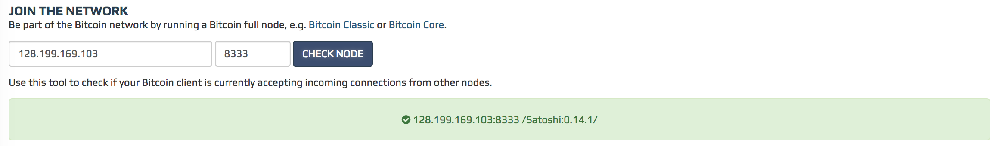

Docker brings with it a range of benefits like rapid deployment, easy portability and isolation & security among other things. These benefits already sound like a good reason to run your web app or Bitcoin Node within a Docker container, but management of your docker containers still requires logging into a server somewhere and running a list of commands. Let alone scaling up nodes for a highly available application during periods of peak load. This is where Rancher comes in to make things a breeze.

Rancher makes it easy to create Docker hosts on cloud providers, or on your own servers. It comes bundled with Rancher UI, which allows you to launch compute nodes directly from a web interface, making it easy to create and manage multi-node deployments from a single interface.

I had already been looking into creating Dockerised Bitcoin Nodes and with all the [UASF](http://www.uasf.co/) hoo-ha going in the Bitcoin world at the moment, I thought it would be a good example to orchestrate deployment of Bitcoin full nodes via Rancher so you can scale up your Node count and show support for [BIP148](https://github.com/bitcoin/bips/blob/master/bip-0148.mediawiki) (or not).

I will be using DigitalOcean to host Rancher and the Bitcoin Full Nodes.

*Large parts of this guide have been taken verbatim from DigitalOcean's [How To Manage Multi-Node Deployments with Rancher and Docker Machine on Ubuntu 16.04](https://www.digitalocean.com/community/tutorials/how-to-manage-multi-node-deployments-with-rancher-and-docker-machine-on-ubuntu-16-04) guide. There is no need to reinvent the wheel, where it makes sense, but there are some important changes I have made to apply specifically to the deployment of Bitcoin Nodes and automating block storage provisioning to store the blockchain (as of this writing 122 GB).*

### Step 1 — Creating a DigitalOcean Droplet to Host Rancher

In order to use Rancher to manage Docker hosts and containers, we need to get Rancher running. We'll use DigitalOcean's Docker image and a bit of **User Data** to get up and running quickly.

First, log into your DigitalOcean account and choose **Create Droplet**. Then, under the **Choose an Image** section, select the **One-click Apps** tag. Select the **Docker 17.05.0** for **Ubuntu 16.04** image.


Next, select a **1GB** Droplet and choose a datacenter region for your Droplet.

Then select **User Data** in the **Select additional options** section, and enter the script below in the text box that appears. This script tells the Droplet to fetch the `rancher/server` Docker image and start a Rancher server in a container upon start-up.

```bash
#!/bin/bash
docker run -d --name rancher-server -p 80:8080 rancher/server
```

Finally, add your SSH keys, provide a host name for your Droplet, and press the **Create** button. Then wait while your new server is created. Once the server starts, Docker will download a Rancher image and start the Rancher server, which make take a few more minutes.

To double-check that Rancher is running, log in to your new Droplet:

```bash
$ ssh root@your_ip_address
```

Once logged in, get a list of running Docker containers:

```bash
$ docker ps
```

You'll see the following, which confirms Rancher is running:

```bash
Output
ec5492f1b628    rancher/server  "/usr/bin/entry /usr/"  15 seconds ago  Up 13 seconds   3306/tcp, 0.0.0.0:80->8080/tcp  rancher-server
```

If you don't see this, wait a few minutes and try again. Once you verify that Rancher is running, you can log out of the machine.

### Step 2 - Configuring Authentication for Rancher

Once your server is up, browse to `http://your_server_ip/` to bring up the Rancher UI. Because the Rancher server is currently open to the Internet, it's a good idea to set up authentication so the public can't make changes to our environment. Let's configure Rancher to use Github OAuth-based authentication.

You will see a warning icon next to the **ADMIN** menu item at the top of the screen.


If you hover over this link, you'll see the message **Access Control is not configured**. Choose **Access Control** from the **ADMIN** menu. Github will be selected as the default authentication method, so follow the instructions on the page to register a new application with GitHub.

Once you've registered the application, copy the **Client ID** and **Client Secret** from the application page on Github into the respective text fields in the Rancher user interface. Then click **Save**.

Then, under **Test and enable authentication**, click **Authenticate with GitHub**, and click **Authorize application** in the window that pops up. The page will reload and the instructions on setting up OAuth will be replaced by the **Configure Authorization** section. Add any additional users and organizations that should be given access to Rancher. If you make any changes, click the **Save** button.

Next, let's create an *environment* to organise our compute hosts.

### Step 3 — Creating an Environment

An environment in Rancher lets us group our hosts into logical sets. Rancher provides an environment called **Default**, but let's create our own. Click the **Default** link at the top of the screen to reveal the **Environments** menu, then click **Manage Environments**. Click the **Add Environment** button that appears on the page.

Fill in `Bitcoin Mainnet` as the name for your project. Leave all of the other settings at their defaults and click **Create**. Then use the project selection menu again to select your new environment.

### Step 4 - Create a custom Docker Install script

This is where things get a bit trickier. As previously mentioned the Bitcoin blockchain is currently a whopping 122 GB and we need to store that somewhere. DigitalOcean (and for that matter most other VPS providers) doesn't offer enough storage on there basic VPS plans, unless you want to start paying upwards of $160 USD per month.

To get around this I will utilise DigitalOcean's Block storage, which brings the cost down to $25 USD per month ($10 for the 1 GB instance and $15 for 150 GB of block storage). Still arguably expensive to run a single Bitcoin Node, but maybe you got rich of the first Bitcoin boom and now money is no object!

So before we go ahead and start launching our hosts, we want to automate the provisioning of this block storage for each host. We use Rancher now, we don't want to have to SSH into the host and configure this every time!

By default Rancher will configure each new host using an install script found in [this](https://github.com/rancher/install-docker) GitHub repository.

We'll still be using this script, but will also need another script to automate the creation, attaching and mounting of our block storage volume to the host and one to tie them both together.

Create a new shell script called `do-provision-volume.sh` and paste in the below code (setting the do_token variable with your actual DigitalOcean token).

```bash
#!/bin/sh
set -e

do_token="personal_access_token_for_the_digitalocean_api"
do_volume_name="bitcoin-data-$(uuidgen)"
do_volume_region="sgp1"
do_droplet_id="$(curl http://169.254.169.254/metadata/v1/id)"


# Configure DigitalOcean volume
#
# Create a new volume
curl -X POST -H "Content-Type: application/json" -H "Authorization: Bearer ${do_token}" -d '{"size_gigabytes":150, "name": "'${do_volume_name}'", "description": "", "region": "'${do_volume_region}'"}' "https://api.digitalocean.com/v2/volumes"
sleep 20

# Get volume ID
do_volume_id="$(curl -X GET -H "Content-Type: application/json" -H "Authorization: Bearer ${do_token}" "https://api.digitalocean.com/v2/volumes?name=${do_volume_name}&region=${do_volume_region}" | awk '{ print substr( $0,20,36 ) }')"

# Attach volume to droplet
curl -X POST -H "Content-Type: application/json" -H "Authorization: Bearer ${do_token}" -d '{"type": "attach", "droplet_id": '${do_droplet_id}', "region": "'${do_volume_region}'"}' "https://api.digitalocean.com/v2/volumes/${do_volume_id}/actions"
sleep 20

# Format the volume with ext4
# Warning: This will erase all data on the volume. Only run this command on a volume with no existing data
sudo mkfs.ext4 -F /dev/disk/by-id/scsi-0DO_Volume_${do_volume_name}

# Create a mount point under /mnt
sudo mkdir -p /mnt/${do_volume_name}

# Mount the volume
sudo mount -o discard,defaults /dev/disk/by-id/scsi-0DO_Volume_${do_volume_name} /mnt/${do_volume_name}

# Change fstab so the volume will be mounted after a reboot
echo /dev/disk/by-id/scsi-0DO_Volume_${do_volume_name} /mnt/${do_volume_name} ext4 defaults,nofail,discard 0 0 | sudo tee -a /etc/fstab

# Create a bitcoind-data volume to persist the bitcoind blockchain data
docker volume create --name=bitcoind-data --opt device=/mnt/${do_volume_name} --opt o=bind
```

Then tie it all together with an `install.sh` script. Make sure to update the second curl URL with the hosted location of your `do-provision-volume.sh` script.

```bash
#!/bin/sh
set -e

curl -s -o- https://releases.rancher.com/install-docker/1.12.sh | bash

curl -s -o- http://your_server_ip_or_fqdn/do-provision-volume.sh | bash
```

You can find examples of these scripts over on my [install-docker Github repository](https://github.com/mitchellcash/install-docker).

**Note: I do understand that this is horribly insecure as your Personal Access Token for the DigitalOcean API sits on a public web server somewhere. If this is a concern you can manually run these scripts after Step 5, but before Step 6. Rancher doesn't allow Environment Variables for host creation, so if you know a better way to keep this automated and secure, send me an email.**

Now let's launch some hosts in our Bitcoin Mainnet environment using the new install script.

### Step 5 — Launching Rancher Compute Nodes

Once you have secured your Rancher deployment and added a project, select **Hosts** from the **Infrastructure** menu and then click the **Add Host** button.

On the **Add Host** screen, you will see several providers: **Custon**, **Amazon EC2**, **DigitalOcean**, **Azure**, and **Packet**. The **Custom** option lists the steps to manually launch a Rancher compute node on a server with Docker pre-installed. The others are used to launch compute nodes on the respective cloud systems.

Select the **DigitalOcean** option, as shown in the following figure:


In the **Access Token** field, place your Personal Access Token for the DigitalOcean API. Then press **Next: Configure Droplet**.

A new set of fields will appear on the screen. Fill in the following details:

* **Name**: The name of the server you want to create. In this case, enter `Bitcoin-Host-01`.
* **Quantity**: Leave this at 1. Increasing this will create multiple hosts and automatically name each one for you.
* **Image**: Select the **Ubuntu 16.04.2 x64** image from the list. Some entries in the list are disabled because they are not compatible with Rancher.
* **Size**: The size of the Droplet. Select the option for a **1GB** Droplet.
* **Region**: The region where your Droplet will be created. In order to store the full block chain choose one that allows Block Storage. Currently, volumes are available in NYC1, SFO2, FRA1, SGP1, and TOR1.
* **Enable IPv6**: Yes - check this box.

**Advanced Options**
* **Docker Install URL**: http://your_server_ip_or_fqdn/install.sh *(this is the script we created in Step 5)*

Finally, click Create. Rancher will use Docker Machine to create the specified Droplet and run our install script to provision the block storage and Docker on it. Rancher will also run rancher-agent on the newly created Droplet, which will in turn register with the Rancher server.

Within a few minutes you'll see your new host in the Rancher UI. You will also get some basic information about the host such as its IP address, processor clock-speed, memory, and storage.


You can repeat this step as many times as you need to launch more compute nodes into your deployment.

### Step 6 — Launching your Bitcoin Node Docker Image

Once you open up your host in the Rancher UI, click on the **Add Container** button.

A set of fields will appear on the screen. Fill in the following details:

* **Name**: bitcoind-node
* **Select Image**: kylemanna/bitcoind

**Port Map**
* **Public Host IP**: <blank>
* **Public Host Port**: 8333
* **Private Container Port**: 8333

* **Public Host IP**: 127.0.0.1
* **Public Host Port**: 8332
* **Private Container Port**: 8332

**Volumes Tab**
* **Volumes**: bitcoind-data:/bitcoin

Click Create. Rancher will now run the `kylemanna/bitcoind` Docker image and expose it to the world.

 Now let's explore Rancher's built-in monitoring, and how to deactive and delete notes.

### Step 7 - Monitoring and Scaling Your Deployment

Once your compute nodes are provisioned, click on the name of one of your hosts to pull up the Monitoring screen, where you can see the CPU utilization and memory consumption of that compute node.


You can also remote into the host and access the daemon's output thanks to the [docker logs command](https://docs.docker.com/engine/reference/commandline/logs/). You can find your Docker ID by opening the bitcoind-node container in the Rancher UI.

```bash
$ docker logs -f docker_id
```

The last check you can do is enter your host IP and port 8333 into the **Check Node** tool over at [Bitnodes](https://bitnodes.21.co/).



To add more Bitcoin Nodes to the network, just repeat steps 3 to 6 above. You can shut down any additional nodes by visiting the **Hosts** page, locating your host, and clicking the **Deactivate** icon (the box with two vertical lines, as shown in the following figure:


You can then subsequently click either **Activate** or **Delete** from the menu to the right of the **Deactivate** button.

### Conclusion

It may not be the perfect use or demonstration of Rancher, but I'm interested in cryptocurrencies and also trying new things, so this is what you get!
