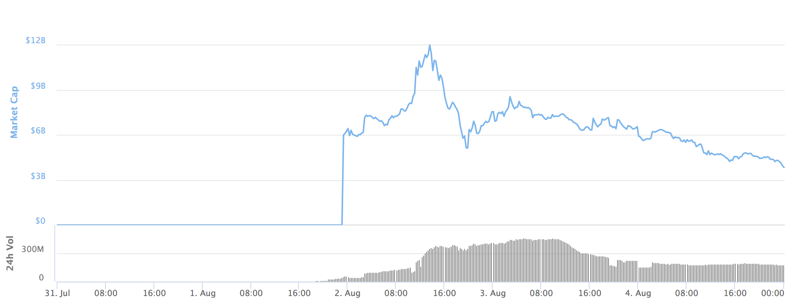

[Gavin Andresen](http://gavinandresen.ninja/practice-safe-signing), known for being the lead developer on Bitcoin Core, highlights a very real cryptocurrency attack vector, especially applicable in recent times, and how best to protect your coins from such an attack.

> Are you holding some cryptocurrency secured by a paper wallet in a safe deposit box? Good for you! That’s an excellent way to keep it safe.
>
> But then your currency splits. Last week that piece of paper was worth 100 FooCoins, and this week it is worth 100 FooCoins and 100 BarCoins.
>
> If you think one side of the split is a terrible idea, doomed to fail, you might be tempted to go get your paper wallet, “sweep” the coins into a wallet that supports the bad coin, and move them to an exchange to cash out (or maybe buy more of the good coin).
>
> Great! I don’t give investment advice. But I will encourage you to sweep the “good” coins, first, and move them to a new wallet. Don’t be lazy and just write “BadCoins swept Nov 11, 2017” on the paper wallet and put it back in the vault.

So why does this matter so much?

Let's pick Bitcoin as an example and say we have a group of miners who want to increase the current Bitcoin block size, doubling the number of transactions that can be included in a single block. They gain enough support and fork the Bitcoin Core network.

Holders of Bitcoin continue to have the same number of Bitcoins as before the fork, but they now also hold the equivalent number of coins in the new fork.

What tends to happen in these scenarios is that people rush to sell their "bonus" coins. This can be seen when Bitcoin Cash forked from Bitcoin in August of this year and lost as much as 50% of its market cap within the first 3 days.

All of this seems innocent enough, but Gavin points out that unless you have the technical ability to audit the code, you could unknowingly be victim to them changing the transaction signature algorithm in such a way that it [leaks your private keys in the signature data that is broadcast to the world](https://bitslog.wordpress.com/2014/06/09/deterministic-signatures-subliminal-channels-and-hardware-wallets/).

Now all of the holders who transferred their new forked coins have just leaked the private keys for the same addresses that are holding their coins on the original Bitcoin network.

So always remember to sweep the original (or "good" coins) first and not rush at every opportunity that sounds like "free money" without first acting diligently.
